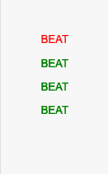
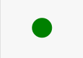
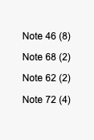

# Notes Sound Generator

## Introduction

Blind people are unable to concurrently "read and play" the score but they have incredible tactile and auditory abilities, this project focuses on playing the time beats and the notes on smartwatches using the vibration functionality.

`Notes Sound Generator` is a [MuseScore 3.x](https://musescore.org) plugin for blind people; it is capable of reading the current score (which can be edited with [MuseScore](https://musescore.org) itself) and extracting, at playing time, the notes and the time signature of the score.

My solution uses the MuseScore plugin development stack, and the [Alphatab](https://alphatab.net/) JS library to extract the notes and the time signature from a score.
The score is a MusicXML file generated from the developed [MuseScore](https://musescore.org) plugin; this plugin executes the job of exporting the current score (eventually edited with the program itself) in MusicXML format and then passing it to a webpage where an instance of [Alphatab](https://alphatab.net/) is executed. The webpage is able, exploiting the low-level APIs of the library, to play the score and vibrate on smartwatches the time beats and the currently played notes.

## Implementation details

In the implementation, the `playing of the time beats` is communicated by descriptive text and a point; they are colored in red for the first beat of a bar, and in green for the other beats.





The `current played notes` are communicated by descriptive text which indicates the [MIDI note number](https://www.inspiredacoustics.com/en/MIDI_note_numbers_and_center_frequencies) and the duration.



### MuseScore plugin side

A `partial` portion of the `plugin` code is shown below; it emphasizes its behavior.

```js
function openGenerator(filePath, filename) {
  var newFilePath = filePath + "/src/" + filename;
  if (!writeScore(curScore, newFilePath, "xml")) {
    alert.text = "Cannot export the current score, try again.";
    alert.open();
    return;
  }
  Qt.openUrlExternally("http://localhost:8000?filename=" + filename);
  Qt.quit();
}

onRun: {
  var filename = "new-exported.xml";
  openGenerator(filePath, filename);
}
```

### Webpage side

#### Library initialization

```js
const urlParams = new URLSearchParams(window.location.search);
const urlFileName = urlParams.get("filename");
const settings = {
  file: urlFileName ?? "/file.xml",
  player: {
    enablePlayer: true,
    enableCursor: true,
    enableUserInteraction: true,
    soundFont: "/dist/soundfont/sonivox.sf2",
    scrollElement: wrapper.querySelector(".at-viewport"),
  },
};
let api = new alphaTab.AlphaTabApi(main, settings);
api.masterVolume = 0;
```

#### The `scoreLoaded` event

```js
api.scoreLoaded.on((score) => {
  trackList.innerHTML = "";
  score.tracks.forEach((track) => {
    trackList.appendChild(createTrackItem(track));
  });
  createMetronome(score);
});
```

#### The `createMetronome` function

```js
function createMetronome(score) {
  let tempoAutomation = 0;
  score.masterBars.forEach((bar) => {
    if (
      bar.tempoAutomation != null &&
      tempoAutomation != bar.tempoAutomation.value
    ) {
      tempoAutomation = bar.tempoAutomation.value;
    }
    let barDuration =
      parseFloat(60 / parseInt(tempoAutomation)) *
      parseInt(bar.timeSignatureNumerator);
    if (parseInt(bar.timeSignatureNumerator) == 0) return;
    let beatsWaitTime = barDuration / parseInt(bar.timeSignatureNumerator);
    for (
      let index = 1;
      index <= parseInt(bar.timeSignatureNumerator);
      index++
    ) {
      if (index == 1) {
        timeSignaturePauses.push({
          waitTime: beatsWaitTime,
          isFirstBeat: true,
        });
      } else {
        timeSignaturePauses.push({
          waitTime: beatsWaitTime,
          isFirstBeat: false,
        });
      }
    }
  });
}
```

#### The `play/pause` event

```js
playPause.onclick = (e) => {
  if (e.target.classList.contains("disabled")) {
    return;
  }
  if (e.target.classList.contains("fa-play")) {
    let currentBarIndex = getCurrentBarIndex(api.tickPosition);
    api.tickPosition = api.score.masterBars[currentBarIndex].start;
    metronomeWorker = new Worker("/js/metronomeWorker.js");
    beatLogger.innerHTML = "";
    metronomeWorker.onmessage = function (message) {
      if (message.data.isFirstBeat) {
        beatLogger.innerHTML = '<p style="color: green;">BEAT</p>';
        highlightBeat("green");
      } else {
        beatLogger.innerHTML += '<p style="color: red;">BEAT</p>';
        highlightBeat("red");
      }
      beatLogger.scrollTo(0, beatLogger.scrollHeight);
    };
    metronomeWorker.postMessage({
      startIndex: currentBarIndex,
      pauses: timeSignaturePauses,
    });
    api.playPause();
  } else if (e.target.classList.contains("fa-pause")) {
    api.playPause();
    noteLogger.innerHTML = "";
    beatLogger.innerHTML = "";
    metronomeWorker.terminate();
  }
};
```

#### The `activeBeatsChanged` event

```js
api.activeBeatsChanged.on((args) => {
  noteLogger.innerHTML = "";
  for (let index = 0; index < args.activeBeats.length; index++) {
    const duration = args.activeBeats[index].duration;
    const noteValues = Array.from(
      args.activeBeats[index].noteValueLookup.keys()
    );
    let i = 0;
    for (i = 0; i < noteValues.length; i++) {
      noteLogger.innerHTML +=
        "<p>Note " + noteValues[i] + " (" + duration + ")</p>";
    }
    noteLogger.scrollTo(0, noteLogger.scrollHeight);
  }
});
```

## Execution Tutorial

This tutorial shows how to locally deploy and run the plugin.

- **[Prerequisites](#prerequisites)**
- **[Repository](#repository)**
- **[Build](#build)**
- **[Run on MacOS](#run-on-macos)**
- **[Run on other platforms](#run-on-other-platforms)**

### Prerequisites

- [MuseScore 3](https://musescore.org/download#older-versions)
- [Docker and Docker Compose](https://www.docker.com) (Application containers engine)
- The port 8000 free on your local machine

### Repository

Clone the repository into the `Plugins` folder of [MuseScore 3](https://musescore.org):

```sh
$ cd PathToYourMuseScore3Folder/Plugins
$ git clone https://github.com/IvanBuccella/notes-sound-generator
```

### Build

Build the local environment with Docker:

```sh
$ cd notes-sound-generator
$ docker-compose build
```

### Run on MacOS

```sh
$ chmod +x run.sh
$ ./run.sh
```

### Run on other platforms

In order to execute the plugin you need to do the following steps in order:

- Run the docker container:

```sh
$ docker-compose up -d
```

- And then, launch the [MuseScore](https://musescore.org) program

## Contributing

This project welcomes contributions and suggestions. If you use this code, please cite this repository.

## Citation

Credit to [CoderLine](https://github.com/CoderLine): [AlphaTab](https://github.com/CoderLine/alphaTab) is a cross platform music notation and guitar tablature rendering library. You can use alphaTab within your own website or application to load and display music sheets from data sources like Guitar Pro or the built in markup language named alphaTex.
